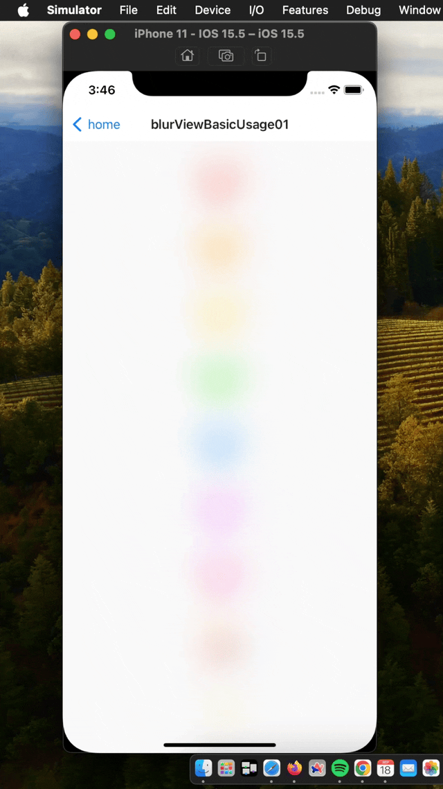

# react-native-ios-visual-effect-view

A simple library to use `UIVisualEffectView` in `react-native`.


<br>

[`RNIVisualEffectCustomFilterViewTest01Screen`](example/src/examples/RNIVisualEffectCustomFilterViewTest01Screen.tsx)


<br><br>

## 🚧⚠️  Work in Progress ⚠️🚧

This library + documentation is currently not finished yet. For now, please browse through [examples](example/src/examples) directory to get a rough idea on how to use this library. Jump to [basic usage section](#c-basic-usage) for example code + gif.

<br><br>

### Acknowledgements

The initial version of this library  (i.e. version `0.x`) was made possible through a generous `$3,750` sponsorship by [natew](https://github.com/natew) + [tamagui](https://github.com/tamagui/tamagui) over the course of 4 months (from: `05/27/24` to `09/30/24`) 🐦✨

<br>

very special thanks to: [junzhengca](https://github.com/junzhengca), [brentvatne](https://github.com/brentvatne), [expo](https://github.com/expo), [EvanBacon](https://github.com/EvanBacon), [corasan](https://github.com/corasan), [lauridskern](https://github.com/lauridskern), [ronintechnologies](https://github.com/ronintechnologies), and [gerzonc](https://github.com/gerzonc) for becoming a monthly sponsor, and thank you [fobos531](https://github.com/fobos531) for being a one time sponsor 🥺 (if you have the means to do so, please considering sponsoring [here](https://github.com/sponsors/dominicstop))

<br><br>

## A. Introduction

https://github.com/user-attachments/assets/74bf8afa-91ed-49d8-80aa-a17b8e7969b0

https://github.com/user-attachments/assets/16d2c2ee-5453-43ea-bd3f-aa8331fbcd58

<br>

* ❤️ Support for using `UIVisualEffectView` + all the system [`UIBlurEffectStyles`](https://github.com/dominicstop/react-native-ios-utilities/blob/master/src/constants/UIBlurEffectStyles.ts).
* 🧡 Support for using custom blur radius and effect intensity (percent).
* 💚 Support for animating the blur effect style + blur radius changes.
* 💙 Support for creating and using filters (WIP)
* 💜 Runs on the old + new architecture (paper + fabric).

<br><br>

## B. Installation

**Note**: Support for the new architecture (fabric), and backwards compatibility for the old architecture (paper) is handled via a peer dependency to [`react-native-ios-utilites@v5`](https://github.com/dominicstop/react-native-ios-utilities).

```sh
# 1. install library + dependencies
npm install react-native-ios-visual-effect-view@next
npm install react-native-ios-utilities@next

# 2. then run pod install (uses auto-linking)
cd ios && pod install
```

<br><br>

### Updating

This library has cocoapods dependency to [`VisualEffectBlurView`](https://github.com/dominicstop/VisualEffectBlurView) and [`DGSwiftUtilities`](https://github.com/dominicstop/DGSwiftUtilities), so you may need to update them separately (as needed).

```sh
# A. Either update this specific pod...
pod update VisualEffectBlurView DGSwiftUtilities
pod install --repo-update

# B. Or update all the pods
pod update
```

<br><br>

## C. Basic Usage

hello! please see [`RNIBlurViewBasicUsage01`](example/src/examples/RNIBlurViewBasicUsage01.tsx) for the full example


```js
// 📝 Note: for the sake of brevity, some of the code is omitted...
import { RNIBlurView } from 'react-native-ios-visual-effect-view';


export function RNIBlurViewBasicUsage01() {
  return (
    <View style={styles.container}>
      <Text style={styles.label}>
        {'❤️\n🧡\n💛\n💚\n💙\n💜\n💖\n💃\n✨'}
      </Text>
      <RNIBlurView
        style={styles.effectOverlay}
        blurMode={{
          mode: 'blurEffectSystem',
          blurEffectStyle: 'prominent',
        }}
        animationConfig={{
          duration: 1,
          mode: 'presetCurve',
          curve: 'easeOut',
        }}
        animationDelay={1}
      />
    </View>
  );
}
```



<br><br>

## Contributing

See the [contributing guide](CONTRIBUTING.md) to learn how to contribute to the repository and the development workflow.

<br><br>

## License

MIT

---

Made with [create-react-native-library](https://github.com/callstack/react-native-builder-bob)
